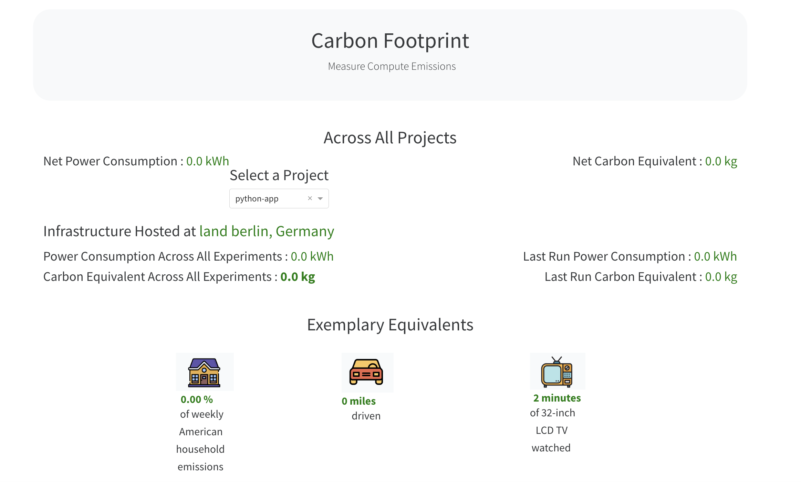

# Monitoring carbon emissions: making the impact of your Python code visible 🏭 📈

*“If the Internet was a country, it would be the 4th largest polluter”*  [[1](https://www.sustainablewebmanifesto.com/#citation)]

This workshop is for developers, data scientists, and anyone curious about their code’s environmental footprint. No prior observability or carbon-metrics experience is needed—just basic Python and Docker skills.

Through hands-on exercises you will:
1. Learn core observability concepts—why monitoring matters, what makes a good metric, and common pitfalls.  
2. Build and expose your own runtime metrics in Python.  
3. Scrape metrics with Prometheus and visualize them in Grafana dashboards.  
4. Instrument your code for carbon-emissions tracking and integrate those metrics into your dashboards.

Join us to gain hands-on experience making your code more carbon-conscious, and leave equipped to integrate these skills into your daily work—making a real difference for our planet.

This workshop has been developed for PyCon Italy 2025 by @terezaif and @sleepypioneer. It builds on material originally developed by @sleepypioneer and @jasongwartz, with iterations including work from @emilywoods, @Vinesse and @Simpcyclassy.

---

### Agenda

This has been designed as a self paced workshop, with a short introduction from the workshop leaders, support during the workshop and a collective reflection at the end. It is likely you will not complete all the material before the end of the workshop, particularly the bonus material, but it is our hope that by joining the workshop you feel enabled to continue and also apply these techniques to your own codebases.

* [Introduction: What is Monitoring and Why is it important?](#introduction-what-is-monitoring-why-is-it-important)  
* [Prerequisites](#prerequisites)  
* [Section 1: Creating custom metrics and exposing them](#section-1-exposing-metrics)  
* [Section 2: Testing in Docker environment](#section-2-testing-in-docker-environment)  
* [Section 3: Carbon metrics & Dashboard](#section-3-carbon-metrics--dashboard)  
* [Troubleshooting](#troubleshooting)  

---

## Introduction: What is Monitoring and Why is it important?

Monitoring is the process of observing and measuring the performance of a system, process, or application. It is used to track the health of a system, identify issues, and make informed decisions about how to improve the system. As one of the pillars of observability, monitoring is essential for ensuring that a system is running smoothly and efficiently, and for identifying and addressing any problems that may arise. It is also important for tracking the performance of a system over time, and for identifying trends and patterns that may indicate areas for improvement/optimization.

---
### Prerequisites

For this workshop you will need [Python 3.12](https://installpython3.com/), [Poetry](https://python-poetry.org/docs/#installation), [Docker](https://docs.docker.com/get-docker/) and [Docker Compose](https://docs.docker.com/compose/install/) running on your machine. *(on mac os docker compose is by default installed with Docker)*

You will also need a free API key for Electricity Map, which you can get by signing up [on their website](https://api-portal.electricitymaps.com/). This key will be used to get the carbon intensity data for a given zone. You will need to set the Zone which you have selected in the code, the default is set to `DE`, which is Germany. You can change this to your preferred zone by changing the `zone` variable in the `main.py` file.


Please note that this repository is linted and formatted using [ruff](https://pypi.org/project/black/) with a max line length of 100. This linting is enforced with github actions configured [in the .github/workflow/lint.yml file](./github/workflow/lint.yml). If you find errors in the code or improvements for the workshop, please feel free to fix them and submit a pull request. We will review it as soon as possible.

## Workshop Content

---

🛑 Before you begin you will need to save your API key in a `.env` file in the root of the project. The file should look like this:

```sh
ELECTRICITY_MAP_API_KEY=your-api-key
```

---

## Section 1: Getting started: Creating custom metrics and exposing metrics

For this section, you can use the following command to install dependencies and run the dev server locally.

```sh
# The Makefile allows us to run commands behind a target name
# If Make is not available you can copy the commands from the Makefile and run them directly ie `cd app && poetry run python main.py`
make dev
```

This command will start a Python server which will have the endpoint `/carbon_intensity` available for the hard coded zone (this should match what your api key zone is set to). The server will be running on `localhost:8001/carbon_intensity` which displays the current carbon intensity for the specified zone.

#### Exposing metrics

To export our metrics we will need to have a server with a handler to *handle* the metrics. We can do this by changing the base class of our HTTPRequestHandler to the `MetricsHandler` provided by the [Prometheus Python client](https://pypi.org/project/prometheus-client/). We also need to add the condition for the `/metrics` endpoint below our `/carbon_intensity` endpoint condition. *(Don't forget to import the `MetricsHandler` from the `prometheus_client`)*

``` python
class HTTPRequestHandler(MetricsHandler):
    ...
    ...
    elif endpoint == '/metrics':
        return super(HTTPRequestHandler, self).do_GET()
```

#### Creating custom metrics

Now that we can expose metrics, we need to create them. Prometheus has a few different data types but the most straight forward is a `Counter`. Counters always increment and can be used to track, for example, the number of requests received (you can then divide this unit over time to calculate requests per second). To create a `Counter`, import it from the Prometheus Python client and instantiate it.

``` python
from prometheus_client import MetricsHandler, Counter
requestCounter = Counter('requests_total', 'total number of requests', ['status', 'endpoint']) # can be declared as a global variable
```

Then we can increment the counter in our handler by calling `requestCounter.inc()` and passing the status code and endpoint as labels. This will allow us to track the number of requests received for each endpoint and their status codes.

``` python
def do_GET(self):
    endpoint = self.path
    if endpoint == '/carbon_intensity':
      # this is only one place we could increment the counter, you could also do this in the
      # fetch_carbon_intensity function, think about how that would change the metrics meaning.
      requestCounter.labels(status=200, endpoint=endpoint).inc()
      return self.get_carbon_intensity()
    elif endpoint == '/metrics':
        return super(HTTPRequestHandler, self).do_GET()
    else:
        self.send_response(404)
        self.end_headers()
```
This will allow us to track the number of requests received for each endpoint and their status codes.

### 🏆 Challenge 1:

Implement the above changes in the `main.py` file. Now try restarting the server (`control c` will stop it) and go to `localhost:8001/metrics`. What do you see? What do you see if you visit `localhost:8001/carbon_intensity` a few times and then go back to the `/metrics` endpoint? As well as a counter for the metric you defined you will also see a gauge has been created (with prefix `_created`), this records the Unix timestamp when that metric was first instantiated. This extra series is purely metadata—intended for OpenMetrics compatibility—and does not represent a second, distinct count of events. ([source](https://prometheus.github.io/client_python/instrumenting/)).

You will also see other (base) metrics, what do these base metrics represent? What happens if you call `.inc()` somewhere else?

Congratulations! You have now created your first custom metric and exposed it via a handler. 🎉🎉🎉

#### Curious to try more? [optional]

How about creating a custom metric to measure the latency of your requests? You might consider a histogram for this as it splits the latency into buckets. You'll find some more information on histograms in the [bonus material](#bonus-material-histograms-in-prometheus) at the bottom of this page.


## Section 2: Exposing carbon metrics with Code Carbon

#### Why

The tech industry is responsible for a significant portion of global carbon emissions. By measuring the carbon emissions of our applications, we can make informed decisions about how to reduce our carbon footprint. This is important for both the environment and for the sustainability of our industry, however, there is often other benefits associated with these changes such as cost savings and performance improvements. As carbon conscientious developers the first step is knowing the current state of affairs, this where carbon metrics come in.

We will be using the Python library from [Codecarbon](https://codecarbon.io/) to instrument our code just as we have done above and pass out the metrics to Prometheus so we can extend our observability stack to include carbon emissions.

#### Impact Metrics

We will use two libraries for measuring our emissions impact, both have their own methodologies for calculating impact metrics:

##### Code Carbon
* **Carbon Intensity (CI) [measured in kgCO2.eq]** of the consumed electricity is calculated as a weighted average of the emissions from the different energy sources that are used to generate electricity, including fossil fuels and renewables. ([Methodology](https://mlco2.github.io/codecarbon/methodology.html#carbon-intensity))

##### Ecologits

EcoLogits employs the Life Cycle Assessment (LCA) methodology, as defined by ISO 14044, to estimate the environmental impacts of requests made to generative AI inference services. [[Methodology](https://ecologits.ai/latest/methodology/)]

* **Global Warming Potential (GWP):** Evaluates the impact on global warming in terms of CO2 equivalents.
* **Abiotic Resource Depletion for Elements (ADPe):** Assesses the consumption of raw minerals and metals, expressed in antimony equivalents.
* **Primary Energy (PE):** Calculates energy consumed from natural sources, expressed in megajoules.


### Codecarbon Quickstart

```sh
# Install dependencies if not done on this branch version already
make deps

make codecarbon-monitor
# You may have to put in your computer's password to allow codecarbon to access your machine's hardware
```

#### Codecarbon Output

You will start to see metrics from your machine.

```sh
[codecarbon DEBUG @ 20:34:14] _get_power_from_cpus - DONT MATCH CPU Power : 0.5262
[codecarbon DEBUG @ 20:34:14] _get_power_from_cpus - DONT MATCH CPU Energy Delta : 0.5262
[codecarbon DEBUG @ 20:34:14] _get_power_from_cpus - MATCH GPU Power : 0.0131
[codecarbon DEBUG @ 20:34:14] _get_power_from_cpus - DONT MATCH GPU Energy Delta : 0.0131
[codecarbon DEBUG @ 20:34:14] AppleSiliconChip : 0.01 W during 6.75 s [measurement time: 1.6425]
[codecarbon INFO @ 20:34:14] 0.000144 kWh of electricity used since the beginning.
[codecarbon DEBUG @ 20:34:14] last_duration=3.4494149684906006
```

Run `control c` to stop the monitoring.

### How to measure specific parts of our code

However, we want to know more about our specific application, and specific operations within it, for this we can use the `codecarbon` library to instrument our application.

Our application has a second endpoint `/predict` which predicts the intensity of a given activity into one of three classes high, middle, or low intensity  The function `predict_carbon_intensity()` uses a transformer model to do this. This is a toy model, and not very useful but is there to provide a more computation task to monitor. If you are interested to see how you can also monitor carbon emissions when training see the bonus material in [./model_training/README.md](./model_training/README.md). We can use the `track_emissions` decorator from the `codecarbon` library to track the emissions of this function. This will allow us to see the emissions of this specific operation and how it changes over time.

``` python
from codecarbon import track_emissions

@track_emissions()
def predict_carbon_intensity():
  ...
```

Now let's start everything running again (make sure you have **stopped** it first!)

```sh
# In a new terminal window from the root of the repository
# Make sure the app is not already running elsewhere!!
make dev
```


Visit your app's page http://localhost:8001/predict, if it will not load, you need to go back to the terminal and enter your password to allow codecarbon to track your machines hardware. Try putting in an activity such as `driving 10 hours` and click `Predict`. You will see the predicted category and it's probability.


Refresh the page a couple of times, you will see the logs for your metrics and a new file `emissions.csv`has been created inside the `app` directory. One thing you may notice is that this slows down the application, this is because the `track_emissions` decorator is running a separate process to track the emissions of the function. This is not ideal for production, but it is useful for development and testing. 
TODO: check why its slow


### Visualizing our metrics with Codecarbon

In a new terminal run the following:

```sh
# Error currently caused by Dash update meaning we have to pin the version of Dash
# https://github.com/mlco2/codecarbon/pull/847
make codecarbon-report
```

Then open [http://127.0.0.1:3333/](http://127.0.0.1:3333/) in your browser to see the Codecarbon dashboard. Note that the dashboard will not update and only contain the metrics up until when you ran the command.




### 🏆 Challenge 2:

Ok your turn! Set up the Codecarbon library to track the emissions of your application. You will see that our application produces such a small amount of emissions currently that it doesn't register on this dashboard, even though we can see values in the CSV. However, as you scale your application and add more features, you will see this number increase.


## Section 3: Putting it all together and visualizing in Grafana

While the Codecarbon dashboard is great for tracking the emissions of your application, it is not as flexible as a tool like Grafana. [Grafana](http://grafana.com) is an open-source metric visualization tool, which can be used to create dashboards containing many graphs and visualize your data in variety of ways. Grafana can visualize data from multiple sources, including Prometheus. In this section, we will show you how to pass the metrics from Codecarbon to Prometheus and then visualize them in Grafana.


We will now need to run the app via `docker compose up --build` this will also run our instance of Prometheus, Grafana and in addition a Prometheus Gateway. We have already configured this to connect the services, if you are interested in learning more about how to do this, take a look at the [docker-compose.yaml](./docker-compose.yaml), [grafana_datasource.yaml](./grafana/grafana_datasource.yaml) and [promtheus.yaml](./prometheus/prometheus.yaml) files.

Lastly Grafana uses authentication, which, for this workshop, is configured in the `docker-compose.yaml` file. The credentials configured for this workshop are:

```
username: pycon2024
password: workshop
```

### Passing our metrics to Prometheus so we can visualize our metrics in Grafana

To pass our carbon metrics we need to use a Prometheus gateway, as the Codecarbon library does not have a server for Prometheus to scrape, [read more about the Prometheus Gateway](#prometheus-gateway).

First stop the app if it is running and update your tracker:

```
tracker = EmissionsTracker(
    project_name="python-app",
    save_to_prometheus=True,
    prometheus_url="http://pushgateway:9091",
)
```

Now run `docker compose up --build` from the root of the repository. First go to your app's endpoint in the browser and run it a few times so that you generate metrics. Again you will be able to see the metrics at the `/metrics` endpoint.

*If you see errors it may be because you still have the previous version of the application running and therefore might be using the same port as you are now trying to access with Docker. You also need to have the Docker daemon running.*

You should then be able to access the Prometheus dashboard on `http://localhost:9090`, we will not actively cover the Prometheus dashboard in this workshop, however you can use it to see the metrics that are being scraped from your application and debug any issues, see the section below [#Navigating the Prometheus UI and using PromQL to query metrics](#navigating-the-prometheus-ui-and-using-promql-to-query-metrics) for tips on getting started.

Go to Grafana at [http://localhost:3000/](http://localhost:3000/), after logging in go to the explore tab. Here you can write a query to see your metrics. For example, you can write `codecarbon_` to see the autocomplete options for the metrics from your app.

Finally, you can add these metrics to your dashboard by clicking the `+` button and selecting `Add Panel` and then `Add Query`. Here you can write your query and then click `Apply` to see your metrics on your dashboard. Try the query below to see your emissions being charted, go back to your application endpoint and run it again a few more times, then refresh the dashboard to see the change.

```
avg(rate(codecarbon_emissions[$__range])) by (project_name)
```

This will show you the average emissions over the time range you have selected. You can also change the visualization type to see your data in different ways, such as a graph or a table.

### 🏆 Challenge 3:

Follow the instructions above to set up Grafana and visualize your metrics. Try out different queries and visualizations to see how your emissions change over time. You can also try adding other metrics from your application to your dashboard (such as the request counter) to see how they relate to your emissions.


## Section 4: ✨ BONUS ✨ Measuring impact when we don't know information about where code is running

### Ecologits

Unfortunately we might be in the situation where we are not able to use Codecarbon to calculate emissions, for example if we are using a third party API. We can use the [Ecologits](https://ecologits.com/) library to calculate estimates for the emissions for some of the popular LLM services, such as OpenAI.

To demonstrate this, we have built a small mock LLM service which will return a mocked response and usage values for tokens and latency. We can then use this fake data to calculate the estimated emissions for our mock service. We pretend that the third party service in this case is Openai, however, please note this is purely for demonstration purposes and does not represent the actual emissions of OpenAI. If you have an Openai API key you could adjust the code to call it instead of the mock service.

If you have built the services with `docker compose up --build` the mock service will be running on `http://localhost:8002/`. You can call the `/chat` endpoint with a JSON body containing the `prompt` and `model` parameters, for example:

```
curl -X POST http://localhost:8002/chat -H "Content-Type: application/json" -d '{
  "messages": [
    {
      "role": "user",
      "content": "What is the carbon intensity of the electricity in Germany?"
    }
  ],
  "model": "gpt-3.5-turbo"
}'
```

You should see a response similar to:

```
{
  "choices": [
    {
      "finish_reason": "stop",
      "index": 0,
      "message": {
        "content": "Mock response to: What is the carbon intensity of the electricity in Germany?",
        "role": "assistant"
      }
    }
  ],
  "created": 1748456161,
  "id": "chatcmpl-1234567890",
  "model": "gpt-3.5-turbo",
  "object": "chat.completion",
  "usage": {
    "completion_tokens": 37,
    "prompt_tokens": 42,
    "total_tokens": 55
  }
}
```

We have also built in a endpoint for our main server `/chat` which will allow you to enter a message and see the emission metrics based on the fake output. You will see we pass these impact metrics to the output, you challenge? Find a good type of metric from Prometheus to use to track these emissions and create dashboard panels in Grafana to visualize them. Be careful the impacts come as Ranges with a max and min value, you will have to think about how you pass them through to Prometheus.


✨ **Go forth and Monitor for a greener codebase!!** ✨


---

#### Navigating the Prometheus UI and using PromQL to query metrics

Prometheus should find and immediately start scraping metrics from the application container. You can check that it's found the application container by looking at the list of "targets" that Prometheus is scraping `http://localhost:9090/targets`

Prometheus uses it's own query language called [PromQL](https://prometheus.io/docs/prometheus/latest/querying/basics/). You can enter PromQL queries in the `/graph` page of the Prometheus UI.

To see the counter exported previously, we can use the PromQL query:

``` promql
requests_total
```

If we want to see this graphed as a rate per-second over time, we use the PromQL query:

``` promql
rate(requests_total[1m])
```


###### Prometheus Gateway

The Prometheus Gateway is a separate service that is used to collect metrics from multiple sources and then push them to Prometheus. This is useful when you have multiple services running and you want to collect metrics from all of them in one place. It is also useful when the application you are running doesn't have a server for which you can run Prometheus for (such as cron jobs or in our case the tracker)


---

### Bonus Material Histograms in Prometheus

We likely will not get to this material due to the workshop length, however for those of you who want to continue we created this section with some additional challenges and information to further support you in monitoring your applications.

We have already exposed metrics of type `Counter`. [Prometheus has four core metrics](https://prometheus.io/docs/concepts/metric_types/), which are:

 - Counter
 - Gauge
 - Histogram
 - Summary

A histogram is a little bit more complicated than a Counter, but it can be very useful!

For example a histogram is useful when you want approximations over a known range of values, such as:
* response duration
* request size

In Prometheus, a histogram measures the frequency of value observations that fall into `buckets`.
For example, we can define a set of buckets to measure request latency. These buckets are groupings which we can use to provide an indication of how long
a single request could take e.g. 0.0 - 0.25s, 0.25 - 0.50s, 0.50 - 0.75s, 0.75 - 1.00s, 1.00s+. The duration of every request will fall into one of these buckets.

In Prometheus, a histogram is cumulative and there are default buckets defined, so you don't need to specify them for yourself.
When using the histogram, Prometheus won't store the exact request duration, but instead stores the frequency of requests that fall into these buckets.

**Let's make a histogram for request latencies**

The first thing we will do is add the import:

```
  from prometheus_client import Histogram
```

Then define our histogram:

```
  requestHistogram = Histogram('request_latency_seconds', 'Request latency', ['endpoint'] )
  requestHistogramCarbonIntensity = requestHistogram.labels(endpoint='/carbon_intensity')
```

Finally we add the following decorator to the piece of code that we want to measure the duration for:

```
  @requestHistogramCarbonIntensity.time()
  def xxxx():
      ...
```

Now restart the application and make a few requests. 👀

#### How to interpret the histogram 

If we curl the `/metrics` endpoint again, a portion of the output will look something like this:

```
request_latency_seconds_count{endpoint="/carbon_intensity"} 5.0
```

This is a `count` again! And we can see the endpoint has received 5 requests. 

We also see our buckets. Here `le` means `less than or equal to`.
We can see from this output that the histogram is cumulative:

```
request_latency_seconds_bucket{endpoint="/carbon_intensity",le="0.005"} 1.0
request_latency_seconds_bucket{endpoint="/carbon_intensity",le="0.01"} 1.0
request_latency_seconds_bucket{endpoint="/carbon_intensity",le="0.025"} 1.0
request_latency_seconds_bucket{endpoint="/carbon_intensity",le="0.05"} 1.0
request_latency_seconds_bucket{endpoint="/carbon_intensity",le="0.075"} 1.0
request_latency_seconds_bucket{endpoint="/carbon_intensity",le="0.1"} 1.0
request_latency_seconds_bucket{endpoint="/carbon_intensity",le="0.25"} 4.0
request_latency_seconds_bucket{endpoint="/carbon_intensity",le="0.5"} 4.0
request_latency_seconds_bucket{endpoint="/carbon_intensity",le="0.75"} 5.0
request_latency_seconds_bucket{endpoint="/carbon_intensity",le="1.0"} 5.0
request_latency_seconds_bucket{endpoint="/carbon_intensity",le="2.5"} 5.0
request_latency_seconds_bucket{endpoint="/carbon_intensity",le="5.0"} 5.0
request_latency_seconds_bucket{endpoint="/carbon_intensity",le="7.5"} 5.0
request_latency_seconds_bucket{endpoint="/carbon_intensity",le="10.0"} 5.0
request_latency_seconds_bucket{endpoint="/carbon_intensity",le="+Inf"} 5.0
```

Finally we see the total sum of all observed values:

```
request_latency_seconds_sum{endpoint="/carbon_intensity"} 1.13912788000016
```

To learn more, you can read about [Prometheus Histogram best practices](https://prometheus.io/docs/practices/histograms/).

---

## Troubleshooting

### Port conflict

If you see the error message below it is likely because you already have either the Docker version or non docker version of the application already running.

```
Error starting userland proxy: listen tcp4 0.0.0.0:8001: bind: address already in use
```

Check you terminal windows to see if you can find where it is running and use `ctrl c` to stop it. Alternatively you can use `lsof -i :8001` to find out the `pid` of the process running at this port and `kill <pid-number>` to stop it. You may have to run these commands as `sudo`.

### Python version

If the App will not start locally and you receive an error referring the version, it may be because you do not have a suitable version of Python available on your machine. The version should be 3.12 or above.

### You don't see your custom metrics in the `/metrics` endpoint

This may be that you have not yet called `inc()` for instance if it is a Counter.

### Requests error from Codecarbon library

Occasionally you may see an error from the Codecarbon library that looks like this:

```sh
[codecarbon ERROR @ 10:24:56] <urlopen error [Errno 8] nodename nor servname provided, or not known>
Traceback (most recent call last):
  File "/Library/Frameworks/Python.framework/Versions/3.11/lib/python3.11/urllib/request.py", line 1348, in do_open
    h.request(req.get_method(), req.selector, req.data, headers,
  File "/Library/Frameworks/Python.framework/Versions/3.11/lib/python3.11/http/client.py", line 1282, in request
    self._send_request(method, url, body, headers, encode_chunked)
  File "/Library/Frameworks/Python.framework/Versions/3.11/lib/python3.11/http/client.py", line 1328, in _send_request
    self.endheaders(body, encode_chunked=encode_chunked)
  File "/Library/Frameworks/Python.framework/Versions/3.11/lib/python3.11/http/client.py", line 1277, in endheaders
    self._send_output(message_body, encode_chunked=encode_chunked)
  File "/Library/Frameworks/Python.framework/Versions/3.11/lib/python3.11/http/client.py", line 1037, in _send_output
    self.send(msg)
  File "/Library/Frameworks/Python.framework/Versions/3.11/lib/python3.11/http/client.py", line 975, in send
    self.connect()
  File "/Library/Frameworks/Python.framework/Versions/3.11/lib/python3.11/http/client.py", line 941, in connect
    self.sock = self._create_connection(
                ^^^^^^^^^^^^^^^^^^^^^^^^
  File "/Library/Frameworks/Python.framework/Versions/3.11/lib/python3.11/socket.py", line 827, in create_connection
    for res in getaddrinfo(host, port, 0, SOCK_STREAM):
               ^^^^^^^^^^^^^^^^^^^^^^^^^^^^^^^^^^^^^^^
  File "/Library/Frameworks/Python.framework/Versions/3.11/lib/python3.11/socket.py", line 962, in getaddrinfo
    for res in _socket.getaddrinfo(host, port, family, type, proto, flags):
               ^^^^^^^^^^^^^^^^^^^^^^^^^^^^^^^^^^^^^^^^^^^^^^^^^^^^^^^^^^^
socket.gaierror: [Errno 8] nodename nor servname provided, or not known

During handling of the above exception, another exception occurred:

Traceback (most recent call last):
  File "/Users/jessica-g/Library/Caches/pypoetry/virtualenvs/python-prometheus-workshop-VCgZRxoQ-py3.11/lib/python3.11/site-packages/codecarbon/output.py", line 266, in out
    self.prometheus.add_emission(dataclasses.asdict(data))
  File "/Users/jessica-g/Library/Caches/pypoetry/virtualenvs/python-prometheus-workshop-VCgZRxoQ-py3.11/lib/python3.11/site-packages/codecarbon/prometheus/prometheus.py", line 70, in add_emission
    push_to_gateway(
  File "/Users/jessica-g/Library/Caches/pypoetry/virtualenvs/python-prometheus-workshop-VCgZRxoQ-py3.11/lib/python3.11/site-packages/prometheus_client/exposition.py", line 372, in push_to_gateway
    _use_gateway('PUT', gateway, job, registry, grouping_key, timeout, handler)
  File "/Users/jessica-g/Library/Caches/pypoetry/virtualenvs/python-prometheus-workshop-VCgZRxoQ-py3.11/lib/python3.11/site-packages/prometheus_client/exposition.py", line 447, in _use_gateway
    handler(
  File "/Users/jessica-g/Library/Caches/pypoetry/virtualenvs/python-prometheus-workshop-VCgZRxoQ-py3.11/lib/python3.11/site-packages/prometheus_client/exposition.py", line 326, in handle
    default_handler(url, method, timeout, headers, data)()
  File "/Users/jessica-g/Library/Caches/pypoetry/virtualenvs/python-prometheus-workshop-VCgZRxoQ-py3.11/lib/python3.11/site-packages/prometheus_client/exposition.py", line 283, in handle
    resp = build_opener(base_handler).open(request, timeout=timeout)
           ^^^^^^^^^^^^^^^^^^^^^^^^^^^^^^^^^^^^^^^^^^^^^^^^^^^^^^^^^
  File "/Library/Frameworks/Python.framework/Versions/3.11/lib/python3.11/urllib/request.py", line 519, in open
    response = self._open(req, data)
               ^^^^^^^^^^^^^^^^^^^^^
  File "/Library/Frameworks/Python.framework/Versions/3.11/lib/python3.11/urllib/request.py", line 536, in _open
    result = self._call_chain(self.handle_open, protocol, protocol +
             ^^^^^^^^^^^^^^^^^^^^^^^^^^^^^^^^^^^^^^^^^^^^^^^^^^^^^^^
  File "/Library/Frameworks/Python.framework/Versions/3.11/lib/python3.11/urllib/request.py", line 496, in _call_chain
    result = func(*args)
             ^^^^^^^^^^^
  File "/Library/Frameworks/Python.framework/Versions/3.11/lib/python3.11/urllib/request.py", line 1377, in http_open
    return self.do_open(http.client.HTTPConnection, req)
           ^^^^^^^^^^^^^^^^^^^^^^^^^^^^^^^^^^^^^^^^^^^^^
  File "/Library/Frameworks/Python.framework/Versions/3.11/lib/python3.11/urllib/request.py", line 1351, in do_open
    raise URLError(err)
urllib.error.URLError: <urlopen error [Errno 8] nodename nor servname provided, or not known>
```

The error arises when Codecarbon tries to push emission data to a Prometheus gateway. The push_to_gateway function in the Prometheus client library attempts to send data using a PUT request but fails because the URL or hostname of the Prometheus gateway cannot be resolved. This is caused by the previous exception in the Codecarbon library and often resolves when you refresh the page or restart the application.

## Contributing to this repository

See an error or potential improvement? We welcome issues or PRs to this repository. Tag @terezaif or @sleepypioneer in your PR and we will review it as soon as possible. 